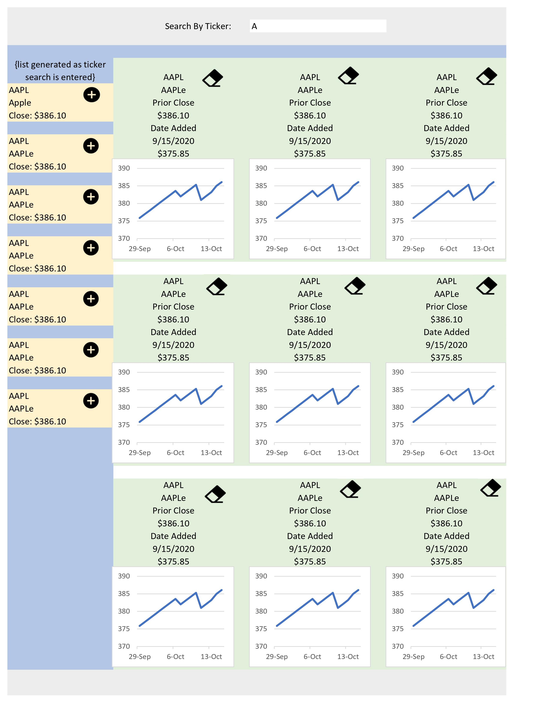

# stock-watch
 
  
  
## Description 
  
Stock Watch is a convenient app for the potential investor on the go.  After initial sign up and log in, the user navigates to the search bar and enters either the company name, or stock symbol to find and save that stock to their watchlist.  The user can view current performance and closing prices, as well as performance over the span of the watch.  Stock data will be accompanied by app logo, corporate headquarter location, and ticker symbol

## Table of Contents
* [Installation](#installation)
* [Usage](#usage)
* [Contributing](#contributing)
* [License](#license)
* [Concepts](#concepts)
* [Planning](#planning)

  
## Installation
  
To run locally

* Clone repository
* `Run npm install`
* `npm run start:dev`

## Usage 

Below is a demonstration of the app functionality


## License
  
mit


## concepts
Original framing idea



Functions of Project

```md
GIVEN an API stock searh search engine
THEN I enter the site and I have not authenticated I am presented with :
1. log on options at the top of the screen ~ 25%
2. before being logged in, the middle 50% of the screen contains the previous day's closing values of major US stock indexes and popular stocks (as selected by the developer) 
3. the bottom %25% remains empty - for future use, copyright, team name and authors

THEN I enter the site and I HAVE authenticated recently or after I have authenticate, I am presented with :
1. log out and other navication options at options at the top of the screen and a stock search bar. top ~25% of the screen
3. 25% of the left side of the middle 50% of the screen will or does contain the resuts from my search
4. 75% of the right side of the middle 50% of the screen contains a scrolling list of cards for each stock user's watch list. 
5. the bottom ~%25% remains empty - for future use, copyright, team name and authors

### User authentication
WHEN I click on the Login/Signup menu option
THEN a modal appears on the screen with a toggle between the option to log in or sign up

WHEN the toggle is set to Signup
THEN I am presented with three inputs for a username, an email address, and a password, and a signup button

WHEN the toggle is set to Login
THEN I am presented with two inputs for an email address and a password and login button

WHEN I enter a valid email address and create a password and click on the signup button
THEN my user account is created and I am logged in to the site

WHEN I enter my account’s email address and password and click on the login button
THEN I the modal closes and I am logged in to the site

WHEN I click on the Search for stock option
THEN I am presented with an input field to search for stocks and a submit button

WHEN I am not logged no search button is displayed and a message is displayed encouraging the visitor to create and account, to develop a stock watch list.
THEN I am presented with NO search button and a message is displayed encouraging the visitor to create and account, to develop a stock watch list.

### watch list creation, stock search
WHEN I am logged in to the site
THEN the menu options change to Search for stocks, and Logout

WHEN I am logged in to the site
THEN the right 75% of the middle 50% of the screen lists my stock watch list as a scrolling set of cards. Or a message encouraging me to search for stocks to create my first watch list

WHEN I am logged in and enter a stock search in the input field and click the submit button
THEN I am presented with several search results, each featuring a stock's company name, and a button to save a selected stock my stock watch list
<!-- www.alphavantage.co www.alphavantage.co The Search Endpoint returns the best-matching symbols and market information based on keywords of your choice -->
<!-- https://rapidapi.com/blog/axios-react-api-tutorial/ -->

WHEN I click on the Save button on a listed stock in my search
THEN that stock's information is saved to my stock watch list and added to my displayed watch list cards

`If the stock DOES NOT exists in the db then that stock is added so future access to that stock's data is local`

WHEN I click on the Remove button of a stock in my watch list card
THEN that stock is deleted from my stock watch list, removed from the displayed stock watch list

WHEN I click on the Logout button
THEN I am logged out of the site and presented with a menu with the option to Login/Signup
```

### watch list card display and function
```md
WHEN I am logged in to the site
THEN each stock in my watch list is displayed as a card containing:
* Stock Ticker, 
* Company Name, 
* Previous Day's Closing Value,
* Date Added to my watch list, 
* Value of the Stock on the date added to my watch list and a, 
* graph of the stock's daily closing value up to the previous day's closing value

## Planning

- Apollo Server

    1. Set up an Apollo Server to use GraphQL queries and mutations to fetch and modify data.

    2. Install an authentication middleware so that it works in the context of a GraphQL API and persists throughout the 
       user's on-line experience.

    3. Use Apollo Client to create an Apollo Provider so that requests can communicate with an Apollo Server.

    4. Deploy the application to Heroku using a MongoDB database hosted at MongoDB Atlas.

    5. Create a working API which will pull the previous day's closing prices for every stock in every user's watch list in the
       system ( server side 8AM automated routine? ) https://api.polygon.io/v2/snapshot/locale/us/markets/stocks/tickers?apiKey=* tickers? = A comma separated list of tickers to get snapshots for.

    6. Allow users to sign up and create a stock watch list

-  Technical Layout

    Application Technical Layout

    Keep it simple!

### Back-End Specifications

You’ll need to complete the following tasks in each of these back-end files:

* `server.js`: Implement the Apollo Server and apply it to the Express server as middleware.

* `auth.js`: Update the auth middleware function to work with the GraphQL API.
	
* `Schemas` directory:

	<!-- * `index.js`: Export your typeDefs and resolvers.

	* `resolvers.js`: Define the query and mutation functionality to work with the Mongoose models.

	* `typeDefs.js`: Define the necessary `Query` and `Mutation` types:

		* `Query` type:

			* `me`: Which returns a `User` type.
		
		* `Mutation` type:

			* `login`: Accepts an email and password as parameters; returns an `Auth` type.

			* `addUser`: Accepts a username, email, and password as parameters; returns an `Auth` type.

			* `saveTicker`: Accepts a stock, description, title, stockId, image, and link as parameters; returns a `User` type. (Look into creating what's known as an `input` type to handle all of these parameters!)

			* `removeStock`: Accepts a stock's `stockId` as a parameter; returns a `User` type. -->
			
    * `User` type:
    <!-- Stores data of signed up user -->

    	* `_id`

    	* `username`

    	* `email`

    	* `watchList` (This will be an array of the `Stock` type.)

    * `Stock` type:
    <!-- bare min. data needed for watchList -->

    	* `_id`

    	* `ticker`

    	* `dateAdded`

    * `Auth` type:
    <!-- bare min. data to share authenticated user -->

    	* `token`

    	* `user` (References the `User` type.)

    * `localStockData` type:
    <!-- data of all user's selected stocks held locally to reduce API calls -->
    <!-- model from the data returned from the selected API -->
```md
    https://www.alphavantage.co/query?function=TIME_SERIES_DAILY&symbol=IBM&apikey=demo
    { 2 items
        "type":"object"
        "properties":{2 items
        "Meta Data":{2 items
        "type":"object"
        "properties":{...}5 items
    }
        "Time Series (Daily)":{2 items
        "type":"object"
        "properties":{...}100 items
    }
    }
    }
    {
        "Meta Data": {
            "1. Information": "Daily Prices (open, high, low, close) and Volumes",
            "2. Symbol": "IBM",
            "3. Last Refreshed": "2021-10-15",
            "4. Output Size": "Compact",
            "5. Time Zone": "US/Eastern"
        },
        "Time Series (Daily)": {
            "2021-10-15": {
            "1. open": "143.3900",
            "2. high": "144.8500",
            "3. low": "142.7900",
            "4. close": "144.6100",
            "5. volume": "3170857"
            },
            "2021-10-14": {
            "1. open": "141.0400",
            "2. high": "143.9200",
            "3. low": "141.0100",
            "4. close": "143.3900",
            "5. volume": "4217305"
            },
    ...
    add data need from polygon such as company logo
    https://api.polygon.io/v1/meta/symbols/AAPL/company?apiKey=*
```
### Front-End Specifications

We will need to create the following front-end files :


* `queries.js`: This will hold the queries.

* `mutations.js`:

	* `LOGIN_USER` will execute the `loginUser` mutation set up using Apollo Server.

	* `ADD_USER` will execute the `addUser` mutation.

	* `SAVE_TICKER` will execute the `` mutation.  (add a ticker to a user's watchList)

	* `REMOVE_TICKER` will execute the `` mutation. (remove a ticker to a user's watchList)

* `server side scheduled
	* `REMOVE_TICKER` will execute the `` mutation. (remove a ticker to a user's watchList)

  
  ---
  
## Questions?
  
For any questions, please contact me with the information below:
 
GitHub:

[@awolrob](https://api.github.com/users/awolrob)
[@fausnightm](https://github.com/fausnightm)
[@ehajek](https://github.com/ehajek)
[@GinleyP87](https://github.com/GinleyP87)
[@Mason021](https://github.com/Mason021)
